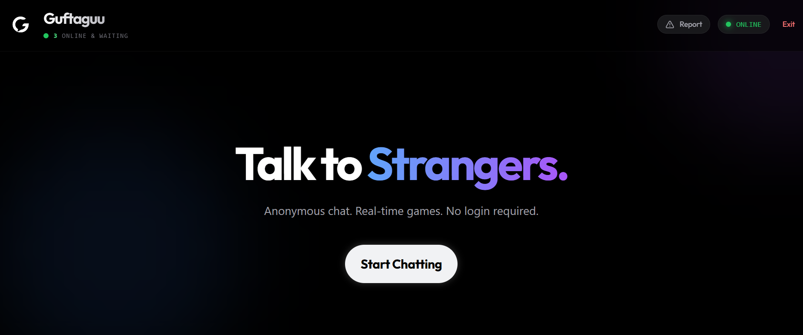

# 💬 **Guftaguu — _"Chat. Play. Connect."_**

Welcome to **Guftaguu** 👋 — a real-time anonymous chat platform where you can instantly talk to strangers *and* challenge them to built-in multiplayer games.

No login. No forms. No data harvesting.  
Just **vibes + websockets + chaos**.

> 🚀 **Live Demo:** https://guftaguu.vercel.app/  
> *(Please be nice to the strangers.)*

---

## ✨ **Features**

- **🕵️ Anonymous Chat**  
  Start talking instantly — no accounts or setup required.

- **🎮 Built-in Multiplayer Games**  
  Challenge your chat partner to:  
    - Tic-Tac-Toe  
    - Connect 4  
    - Rock–Paper–Scissors  

- **📡 Real-Time Stats**  
  Live online user count + matchmaking queue visibility.

- **🛡️ Safety Tools**  
  - Report system (Discord alerts)  
  - Block button to avoid weird people  

- **⚡ Smart Matchmaking**  
  Automatically rematches you if someone disconnects or refreshes.

---

## ⚠️ **Real Talk (aka: “It’s a Feature, Not a Bug”)**

1. **📱 Mobile Layout**  
   Works on phones, but UI may feel tight depending on the screen.  
   → Best experience: **Laptop / Desktop**

2. **🐛 Bugs Happen**  
   If something breaks:  
     - Hit the **Report / Feedback** button  
     - It notifies me instantly  
     - Fixes come fast™

---

## 🛠️ **Tech Stack**

- **Frontend:** React + Vite + TailwindCSS  
- **Backend:** Node.js + Express  
- **Real-Time Engine:** Socket.io  
- **Database:** Redis (matchmaking + session storage)  
- **Deployment:**  
  - Frontend → Vercel  
  - Backend → Render  

---

## 📁 **Folder Structure**

    guftaguu/
    │
    ├── frontend/        # React + Vite client
    ├── backend/         # Node.js + Express + Socket.io server
    └── README.md

---

## 🔑 **Environment Variables**

Inside `/backend`, create a `.env` file:

    REDIS_URL=your_redis_url_here
    DISCORD_WEBHOOK_URL=your_discord_webhook_here
    PORT=5000

---

## 💻 **Running Locally**

### 1️⃣ Clone the Repo

    git clone https://github.com/YOUR_USERNAME/guftaguu.git
    cd guftaguu

### 2️⃣ Start the Backend

    cd backend
    npm install
    npm start

### 3️⃣ Start the Frontend

    cd frontend
    npm install
    npm run dev

Frontend runs at: **http://localhost:5173**  
Backend runs at: **http://localhost:5000**

---

## 📸 **Adding a Screenshot**

Place a `screenshot.png` in your project root and it will show at the top using:

    

---

## 📜 **License**

    MIT License

---

## 🥂 **Enjoy using Guftaguu!**  
Built for fun, curiosity, and maybe a little chaos.
